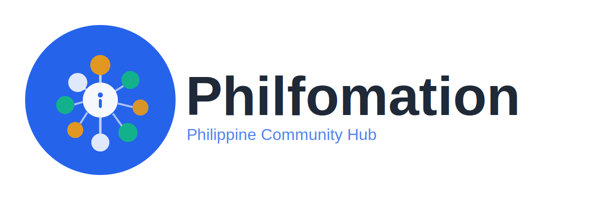

# Philfomation Logo Package

## 📦 로고 파일 목록

### 앱 아이콘
- **icon_512x512.svg / .png** - iOS/Android 앱 아이콘 (512x512px)
- **icon_1024x1024.svg / .png** - App Store용 고해상도 아이콘 (1024x1024px)

### 로고 + 텍스트
- **logo_horizontal.svg / .png** - 가로형 로고 (웹사이트, 명함 등)
- **logo_vertical.svg / .png** - 세로형 로고 (소셜 미디어 프로필 등)

### 특수 버전
- **logo_horizontal_dark.svg / .png** - 어두운 배경용 (다크 모드)
- **logo_monochrome.svg / .png** - 흑백 버전 (인쇄물)

---

## 🎨 로고 컨셉

### 심볼 의미
- **중심 노드**: 커뮤니티의 중심
- **연결된 노드들**: 필리핀의 여러 섬들 + 사람들 간의 연결
- **네트워크 선**: 정보의 흐름, 소통
- **"i" 모양**: Information (정보)

### 색상 의미
- **파란색 (#2563EB)**: 신뢰, 소통, 안정
- **주황색 (#F59E0B)**: 활기, 필리핀의 태양, 열정
- **그린 (#10B981)**: 성장, 커뮤니티, 희망

---

## 📱 사용 가이드

### iOS 앱 아이콘
```
Xcode → Assets.xcassets → AppIcon
- icon_1024x1024.png 업로드
```

### 웹사이트
```html
<!-- 헤더 로고 -->


<!-- 파비콘 -->
<link rel="icon" href="icon_512x512.png">
```

### 소셜 미디어
- **Facebook 커버**: logo_horizontal.png 사용
- **Instagram 프로필**: icon_1024x1024.png 사용
- **Twitter/X**: icon_1024x1024.png 사용

---

## ✅ 체크리스트

### 즉시 해야 할 일:
- [ ] Xcode에 icon_1024x1024.png 추가
- [ ] 웹사이트/랜딩 페이지에 logo_horizontal.svg 추가
- [ ] Instagram @philfomation 계정 만들고 아이콘 설정
- [ ] Facebook 페이지 만들고 로고 설정
- [ ] 명함/마케팅 자료에 로고 적용

### 브랜드 일관성
- **최소 크기**: 아이콘은 최소 48x48px 이상
- **여백**: 로고 주변에 최소 20px 여백 유지
- **배경**: 가능하면 흰색 배경 사용 (어두운 배경은 dark 버전)

---

## 🎯 파일 형식 선택

### SVG (벡터)
- ✅ 크기 조절해도 깨지지 않음
- ✅ 웹사이트에 최적
- ✅ 파일 크기 작음
- 사용처: 웹사이트, 인쇄물, 확대/축소 필요한 곳

### PNG (래스터)
- ✅ 모든 플랫폼 호환
- ✅ 앱 아이콘으로 사용
- ✅ 소셜 미디어
- 사용처: iOS/Android 앱, SNS 프로필, 이메일

---

## 🚀 다음 단계

1. **상표 등록**: IPOPHL에 로고와 함께 상표 신청
2. **브랜드 가이드**: 로고 사용 규칙 문서화
3. **마케팅 자료**: 명함, 전단지, 배너 제작

---

## 💡 추가 버전이 필요하면?

### 가능한 추가 버전:
- 파비콘 (16x16, 32x32, 64x64)
- 소셜 미디어 커버 이미지
- 애니메이션 로고
- 워터마크 버전
- 특수 이벤트용 로고 변형

---

**Created by Claude for Philfomation**
**© 2026 Philfomation - Philippine Community Hub**
